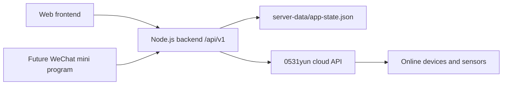

# Agri Monitor Architecture

## Product Goal

Agri Monitor stores and displays data from many online agricultural devices. Each device can expose a different set of sensor channels, and the number of channels can vary by device.

The current priority is reliable login, device import, data ingestion, local storage, realtime display, history tables, and charts. Future work should support AI analysis, automated recommendations, automation plans, and a WeChat mini program.

## High Level Shape



Production data must flow through the backend. The frontend and future mini program should not talk directly to the device cloud. The backend owns cloud login, cloud data fetching, duplicate detection, normalization, persistence, and stable API contracts.

## Runtime

The backend entry point is:

```text
server.js
```

The server listens on:

```text
process.env.PORT || 3000
0.0.0.0
```

Use Node.js 20 or newer. Older Node versions may fail on modern JavaScript syntax.

## Login And Accounts

The system has a web login page. The backend creates a default admin when no admin exists.

```text
account: admin
password: admin123456
role: platform_admin
```

The default password can be overridden with:

```text
ADMIN_PASSWORD
```

Main auth and account endpoints:

```text
POST   /api/v1/auth/login
GET    /api/v1/auth/me
GET    /api/v1/users
POST   /api/v1/users
PUT    /api/v1/users/:id
DELETE /api/v1/users/:id
```

Clients must send the returned bearer token for protected APIs.

## Device Import Rule

Devices are not auto-imported before the user enters the cloud account or identification code.

Correct flow:

1. User enters the cloud account or identification code.
2. The app discovers devices under that account.
3. User selects devices to import.
4. Imported cloud device IDs must match cloud `deviceAddr`.
5. On import, the backend fetches one current realtime-status reading and saves it so the device is not empty.
6. Import must not wait on per-node history queries. `historyList` is for background collector accuracy and manual history supplement, not for blocking device import.

For cloud sensors:

```js
device.id = String(deviceAddr)
device.address = String(deviceAddr)
device.apiConfig.deviceAddr = String(deviceAddr)
```

Do not generate random local IDs for imported cloud sensors. Realtime data, history data, and local storage depend on this stable ID.

In the device editor, `Device ID / Modbus address` is locked in both add and edit flows. New manually added devices fall back to the generated local ID if the address input is empty.

## Data Pulling Strategy

0531yun does not push data to this system, so the backend checks the cloud periodically.

Current backend rule:

1. Importing a device fetches and saves one latest reading.
2. The backend collector checks cloud devices periodically.
3. A new local reading is saved only when the cloud reading changed.
4. If the sensor did not update, do not write another local reading.
5. The frontend displays stored data only. It must not invent new timestamps or values.

Default check interval:

```text
CLOUD_POLL_INTERVAL_MS = 5 minutes
```

This can be overridden with:

```text
CLOUD_POLL_INTERVAL_MS
```

The old 30-second polling idea must not be reintroduced.

## Timestamp Rule

Sensor/cloud record time is the authoritative data timestamp.

Important fields:

```text
deviceTimestamp / ts: parsed device/cloud record time
recordTimeStr: original cloud record time string
receivedAt: backend receive/save time
```

Display rules:

1. History table "reported time" should prefer `recordTimeStr`.
2. If `recordTimeStr` is missing, fallback to `deviceTimestamp`.
3. Charts and duplicate detection use `deviceTimestamp`.
4. `receivedAt` is only for debugging and ingestion tracking.

For 0531yun, the preferred source is history `recordTimeStr`, not server polling time.

## Duplicate Prevention

A local reading signature is based on:

```text
deviceId + deviceTimestamp + normalized values
```

If the same device reports the same device timestamp and same values again, the backend skips it.

This applies to:

1. Backend periodic collector.
2. Device import initial fetch.
3. Manual cloud history supplement sync.
4. Realtime fetch fallback.

## Numeric Values

Cloud numeric values are normalized to one decimal place where possible.

Example:

```text
5.400000095367432 -> 5.4
```

## Current Storage

The current transitional database is:

```text
server-data/app-state.json
```

This is a local JSON database for the current project stage. It can later be migrated to PostgreSQL, MySQL, or another database while keeping the API shape stable.

## Logical Data Model

### tenants

```js
{
  id,
  name,
  status,
  createdAt
}
```

### users

```js
{
  id,
  tenantId,
  account,
  name,
  role,        // platform_admin or tenant_admin
  status,      // active or disabled
  passwordHash,
  createdAt,
  updatedAt,
  lastLoginAt
}
```

### devices

```js
{
  id,
  tenantId,
  name,
  type,        // sensor_soil_api, sensor_env, controller_water, camera, etc.
  locationId,
  address,
  protocol,
  online,
  lat,
  lng,
  notes,
  apiConfig: {
    deviceAddr,
    loginName,
    password,
    apiUrl,
    factors
  },
  metadata
}
```

### channels

Each sensor parameter is treated as a channel. Channel names and counts are dynamic per device.

```js
{
  id,
  tenantId,
  deviceId,
  key,
  externalName,
  displayName,
  category,
  unit,
  valueType,
  precision,
  enabled,
  createdAt
}
```

### sensorReadings

One reading represents one device report at one device/cloud timestamp.

```js
{
  id,
  tenantId,
  deviceId,
  externalDeviceId,
  provider,
  source,              // cloud-poll, cloud-history-sync, cloud-live-fetch, etc.
  ts,
  deviceTimestamp,
  recordTimeStr,
  receivedAt,
  values,              // normalized channel-key values
  externalValues,      // external display-name values
  rawPayloadId,
  signature
}
```

### rawIngestPayloads

Raw payloads are preserved for debugging and future AI analysis.

```js
{
  id,
  tenantId,
  provider,
  externalDeviceId,
  deviceId,
  receivedAt,
  payload
}
```

### realtimeState / serverRealtime

Latest known state per device.

```js
{
  [deviceId]: {
    ok,
    tenantId,
    deviceId,
    externalDeviceId,
    provider,
    timestamp,
    deviceTimestamp,
    receivedAt,
    values,
    externalValues,
    source,
    readingId
  }
}
```

## Important APIs

```text
GET /api/v1/health
GET /api/v1/app-state
PUT /api/v1/app-state
GET /api/v1/device-realtime?deviceId=:id
GET /api/v1/device-history?deviceId=:id
GET /api/v1/readings?deviceId=:id&limit=:n
GET /api/v1/cloud-history-sync?deviceId=:id&startTime=:time&endTime=:time
```

`/api/v1/cloud-history-sync` persists cloud history into `sensorReadings` and skips duplicates.

## Web Display Rules

### Realtime Page

Top section:

```text
Show the latest stored reading only.
If the sensor did not update, keep showing the previous latest reading.
Do not invent timestamps.
```

Bottom table:

```text
Show the latest 10 real readings.
```

### History Records

The history records page loads stored readings from the backend.

Current UI behavior:

1. `Display range` filters only the local table display.
2. `Supplement range` is a separate control for cloud history import.
3. `Filter` is dynamic. It uses the current device's actual parameter names.
4. If no filter checkbox is selected, show all parameters.
5. If one or more filter checkboxes are selected, show time plus selected parameters.
6. The reported time column should display `recordTimeStr` first.

### Charts

Charts update automatically when the location, device, or time range changes. The old manual query button was removed.

Each sensor channel gets its own chart.

Example:

```text
Device has 4 values -> show 4 charts.
Device has 5 values -> show 5 charts.
```

Do not combine unrelated sensor values into one chart unless this is intentionally redesigned later.

## Demo Data Rule

Demo display can remain, but demo data must never affect real data.

Demo records should be clearly marked and excluded from real cloud/device history.

## Mini Program Preparation

The WeChat mini program should communicate directly with the backend API, not the web frontend and not the device cloud.

Recommended future mini program endpoints:

```text
POST /api/v1/auth/login
GET  /api/v1/devices
GET  /api/v1/device-realtime?deviceId=:id
GET  /api/v1/device-history?deviceId=:id&startTime=:time&endTime=:time
GET  /api/v1/locations
GET  /api/v1/channels?deviceId=:id
```

The goal is to keep web and mini program clients on the same backend contract.

## Future AI Analysis Preparation

AI analysis is not implemented yet. The current model should keep enough information for it:

1. Normalized readings.
2. Raw cloud payloads.
3. Device and channel metadata.
4. Separate `deviceTimestamp`, `recordTimeStr`, and `receivedAt`.
5. Duplicate-free historical records.
6. Tenant and account ownership.

Future AI features can analyze trends, detect anomalies, compare channels, and suggest automation plans.

## Implementation Notes

1. Use Unicode escapes for Chinese strings inside JavaScript if encoding problems continue.
2. Keep comments in English.
3. Do not rely on old Markdown files that mentioned 30-second polling.
4. Do not reintroduce frontend-only memory storage for cloud history supplement sync.
5. Do not use random local IDs for imported cloud devices.
6. Use `server.js` as the backend entry point.
