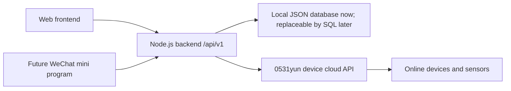

# Agri Monitor Architecture Notes

## Product Goal

This system stores and displays data from many online agricultural devices. Each device can expose different sensor channels, and the number of channels can vary by device.

The current goal is reliable data ingestion, storage, account login, and web display. Future goals include AI data analysis, automatic recommendations, automation plans, and a WeChat mini program.

## Current Architecture



The frontend should not talk directly to the device cloud for production data. The backend is responsible for cloud login, fetching device data, normalizing readings, writing to the local database, and exposing clean APIs to the web frontend and future mini program.

## Login And Accounts

The system has a web login page.

Default admin:

```text
account: admin
password: admin123456
role: platform_admin
```

The admin account can manage other accounts. User-facing clients should call backend auth APIs and include the returned token in later requests.

Important backend endpoints:

```text
POST /api/v1/auth/login
GET  /api/v1/auth/me
GET  /api/v1/users
POST /api/v1/users
PUT  /api/v1/users/:id
DELETE /api/v1/users/:id
```

## Device Import Rule

Devices should not be auto-imported before the user enters the device account or identification code.

Correct behavior:

1. User enters the account or identification code.
2. Backend/frontend discovers devices under that account.
3. User selects which devices to import.
4. On import, the system fetches one current reading immediately and saves it, so the imported device is not empty.

For online cloud devices, the local device ID must match the cloud `deviceAddr`.

```js
device.id = String(deviceAddr)
device.address = String(deviceAddr)
device.apiConfig.deviceAddr = String(deviceAddr)
```

Do not generate random IDs like `dev-xxxx` for cloud sensors. Otherwise realtime data, history data, and local storage will not match.

## Data Pulling Strategy

The cloud side cannot push updates to us, so the backend must check periodically. The frontend should not use frequent polling for display.

Current strategy:

1. When a device is imported, fetch once and save the latest cloud reading.
2. After that, the backend checks the cloud periodically.
3. A new local reading is saved only if the cloud reading actually changed.
4. If the sensor did not update, do not write another local reading.
5. The frontend displays the latest stored reading. It should not invent new timestamps or refresh the top realtime value every few minutes if the sensor did not update.

Recommended backend check interval:

```text
5 minutes
```

Reason: sensors may update around every 30 minutes, but not every sensor has the same update frequency. A 5-minute backend check is frequent enough to notice updates reasonably quickly without causing heavy load when many devices exist. Since unchanged readings are ignored, the database should still only store real sensor updates.

## Timestamp Rule

All sensor readings should use the sensor/cloud record time as the authoritative data timestamp.

Important distinction:

```text
deviceTimestamp / ts: the sensor/cloud record time
receivedAt: when our backend received or saved the data
```

Charts, latest data, history tables, and duplicate detection should use the sensor/cloud timestamp, not the server polling time.

For 0531yun, the preferred timestamp source is cloud history record time, such as `recordTimeStr`, instead of the backend poll time.

## Duplicate Prevention

Do not write duplicate sensor records.

The local reading signature should be based on:

```text
deviceId + deviceTimestamp + normalized values
```

If the same device reports the same sensor timestamp and same values again, skip it.

This applies to:

1. Backend periodic collection.
2. Device import initial fetch.
3. Manual "supplement cloud history" sync.
4. Realtime fetch fallback.

## Value Formatting

Stored and displayed sensor numeric values should keep one decimal place where possible.

Example:

```text
5.400000095367432 -> 5.4
```

## Data Model

The current transitional database is:

```text
server-data/app-state.json
```

This can later be migrated to PostgreSQL, MySQL, or another proper database without changing frontend contracts.

Recommended logical tables/entities:

### tenants

```js
{
  id,
  name,
  status,
  createdAt
}
```

### users

```js
{
  id,
  tenantId,
  account,
  name,
  role,        // platform_admin or tenant_admin
  status,      // active or disabled
  passwordHash,
  createdAt,
  updatedAt,
  lastLoginAt
}
```

### devices

```js
{
  id,          // for cloud devices, must equal String(deviceAddr)
  tenantId,
  name,
  type,        // sensor_soil_api, sensor_env, controller_water, camera, etc.
  locationId,
  address,
  protocol,
  online,
  lat,
  lng,
  notes,
  apiConfig: {
    deviceAddr,
    loginName,
    password,
    apiUrl,
    factors
  },
  metadata
}
```

### channels

Each sensor parameter should be a channel. Devices can have different channel names and counts.

```js
{
  id,
  tenantId,
  deviceId,
  key,
  externalName,
  displayName,
  category,
  unit,
  valueType,
  precision,
  enabled,
  createdAt
}
```

### sensorReadings

One reading represents one device report at one sensor timestamp.

```js
{
  id,
  tenantId,
  deviceId,
  source,              // cloud-poll, cloud-history-sync, cloud-live-fetch, etc.
  deviceTimestamp,     // authoritative sensor/cloud time
  receivedAt,          // backend save time
  values,              // normalized display values by channel/display name
  externalValues,      // raw external names mapped to values
  rawPayloadId,
  signature
}
```

### rawIngestPayloads

Keep raw payloads for troubleshooting and future AI analysis.

```js
{
  id,
  tenantId,
  deviceId,
  source,
  receivedAt,
  payload
}
```

### realtimeState

This stores the latest known reading per device.

```js
{
  [deviceId]: {
    tenantId,
    deviceId,
    deviceTimestamp,
    receivedAt,
    values,
    externalValues,
    dataItems
  }
}
```

## History Supplement Sync

The "supplement cloud history" button must persist imported cloud history to the local database.

Correct behavior:

1. User chooses a cloud device and time range.
2. Backend calls cloud history API.
3. Backend normalizes rows into local `sensorReadings`.
4. Backend skips duplicates using the reading signature.
5. Backend writes the updated database file.
6. Frontend reloads history from backend after sync.
7. Refreshing the page should still show the supplemented records.

The frontend should not store supplemented rows only in memory.

## Web Display Rules

### Realtime Page

Top section:

```text
Show the latest stored reading only.
If the sensor did not update, keep showing the previous latest reading.
Do not invent new timestamps.
```

Bottom table:

```text
Show the latest 10 real readings.
```

### History Records

The history table should load from backend stored readings.

### Charts

Each sensor channel should have its own chart.

Example:

```text
Device has 4 sensor values -> show 4 charts.
Device has 5 sensor values -> show 5 charts.
```

Do not combine two unrelated sensor values into one chart unless explicitly designed later.

## Demo Data Rule

Demo mode can stay, but demo data must never affect real data.

Demo records should be clearly marked, stored separately or marked with metadata, and excluded from real cloud/device history.

## Mini Program Preparation

The WeChat mini program should communicate directly with the backend API, not with the frontend and not directly with the device cloud.

Recommended future mini program API shape:

```text
POST /api/v1/auth/login
GET  /api/v1/devices
GET  /api/v1/device-realtime?deviceId=:id
GET  /api/v1/device-history?deviceId=:id&startTime=:time&endTime=:time
GET  /api/v1/locations
GET  /api/v1/channels?deviceId=:id
```

This keeps web and mini program clients using the same backend contract.

## Future AI Analysis Preparation

AI analysis is not implemented now, but the data model should preserve enough information for it later:

1. Keep normalized readings.
2. Keep raw cloud payloads.
3. Keep device/channel metadata.
4. Keep sensor timestamps and received timestamps separately.
5. Avoid duplicate records.
6. Keep tenant/account ownership clear.

Future AI features can analyze trends, detect anomalies, compare channels, and suggest automation plans based on stored historical data.

## Important Implementation Notes

1. Use Unicode escapes for Chinese strings inside JavaScript files if encoding problems continue.
2. Write comments in English.
3. Do not rely on old Markdown files that mentioned 30-second polling.
4. Do not reintroduce frontend-only memory history for cloud supplement sync.
5. Do not use random local IDs for imported cloud devices.
