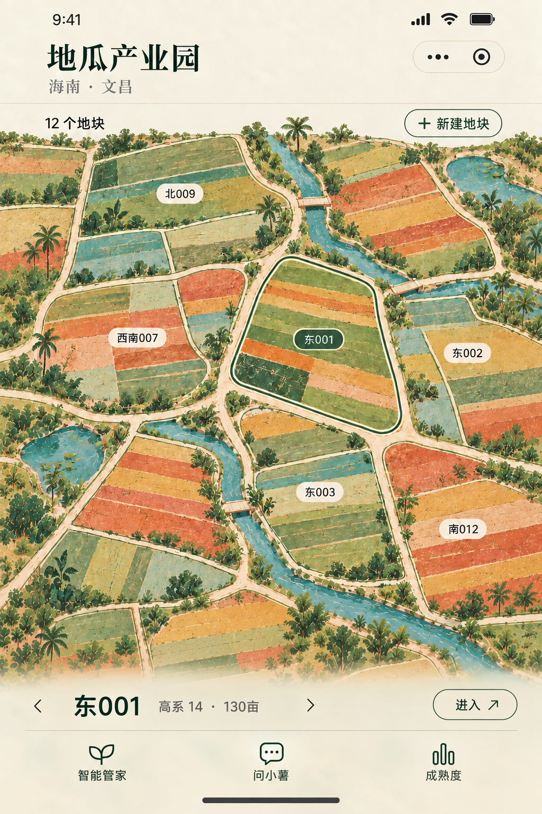

# 产业园地图 · 设计与动效实施 Plan

日期：2026-09-29　版本：暂定 v1　状态：设计规划，尚未实施

本计划保留已暂定的美术方向，作为现有功能工作完成后的改动依据。本次只交付设计文档和参考稿，不修改小程序运行代码。下文的数值是设计初值和验收目标，不代表已经实现或实机测量。

## 1. 交付索引与设计基准

- [界面设计稿与布局规范](design-spec.md)：颜色、边界、顶部、底部、不同地块数量、新建位置及各类状态。
- [动效设计与逐帧分镜](motion-spec.md)：进入园区、园区切换、地图拖动、地块切换、新建、进入详情、返回及中断处理。
- [暂定视觉参考原图](assets/approved-direction-v1.png)：此次规划的美术基准。

参考图确认的是艺术方向和界面关系；图中的名称、数量、面积均为示例。实现时须拆分画面素材、地块轮廓、文字和可点击控件，不将整张图片直接当作交互地图。

### 核心体验

用户进入园区，看到一幅可以拖动的田园画。顶部选择产业园；地图上寻找地块；底部紧凑的一行同步显示选中地块，支持左右切换和进入。新建成功后，地块自然出现在现有田地外围，地图轻移过去让用户看见。

### 已暂定的设计约束

1. 延续 B 方向的绘画色块：碧绿水系、鼠尾草绿、赭黄、少量陶土色，保留手绘笔触与植物。
2. 地块边界明确且柔和：浅色田埂加细轮廓，选中时增强边线；地块保持接近的视觉尺寸。
3. 地图铺满屏幕宽度。两边不设置白色留边；拖到边缘也不露出画布外的白底。
4. 底部采用与画面融合的薄雾面托底，地块选择与导航共用一个底面；信息层级紧凑。
5. 5–6 个地块不放大成几张巨卡；地块多时扩展地图空间，按可见区域渲染。
6. 所有动画服务于位置、选中与园区上下文的变化，减少持续装饰动画。

本包只覆盖园区地图及其进出衔接。此页的颜色与相机动效以本包为准；旧版 `../README.md`、`../animations/motion-spec.md` 继续用于其原有页面，不将新配色自动推广至全局。

## 2. 页面与交互范围

| 场景 | 入口 | 结果 |
|---|---|---|
| 进入园区 | 封面/园区台账的“进入园区” | 地图进入，恢复该园区位置或显示初始视野 |
| 切换产业园 | 顶部园区名称与下拉箭头 | 选择有权限的园区，地图、名称、数量、选中项一起更新 |
| 自由浏览 | 上方地图拖动 | 画布随手移动，松手短惯性，边缘轻收束 |
| 选择地块 | 点击地图地块 | 更新选中轮廓与底部信息，必要时短距离对齐 |
| 按顺序切换地块 | 底部左右滑动或箭头 | 同步切换信息和相机目标 |
| 查找大量地块 | 顶部数量/“全部地块”入口 | 紧凑列表与搜索，选中后定位地图 |
| 新建地块 | 顶部“＋ 新建地块” | 完成表单后，在当前园区外围空位出现并被选中 |
| 进入地块 | 底部“进入 ↗”或再次点已选地块 | 相机轻靠近，打开地块详情 |
| 返回地图 | 详情返回/系统返回 | 恢复进入前的视野和选中项 |

本期拖动不触发创建、不触发进入详情，也不触发园区切换。缩放、旋转和手动拖拽编辑地块位置暂不纳入本期；视野缩放由页面布局与相机控制。

## 3. 数据接入前提：功能完成后先核对

现有代码有地块读取、台账入口和详情能力；尚未确认独立的多产业园模型。账户的数据权限范围、产业园与地块须明确区分，不将账户 tenant 直接当作产业园。

### 需要确认的契约

| 对象/能力 | 最小内容 | 原则 |
|---|---|---|
| 园区 | 稳定 `parkId`、名称、地区、可用操作 | 只返回当前账户允许访问的园区 |
| 地块 | 稳定 `plotId`、所属 `parkId`、名称、品种、面积、详情引用 | 复用功能工作最终确认的真实地块 ID |
| 地图布局 | 世界坐标、形状/样式种子、布局版本 | 按 ID 保存；排序变化不改变位置 |
| 新建 | 字段校验、所属园区、权限、成功返回的正式 ID | 成功后才落位，避免重复提交 |
| 园区切换 | 园区列表、地块列表、错误/空态 | 数据与画面以一次提交更新 |

建议通过 `listParks()`、`listPlots(parkId)`、`createPlot(parkId, input)` 等页面适配能力隔离数据源。这些是拟议的能力名称，不是已存在的服务器接口。实施前确认接口、存储位置和迁移方式，再决定最终命名。

地图为艺术化示意，地块大小不按亩数等比例绘制。若以后接入真实地理边界，应独立设计地理模式，不能以这幅示意图替代真实测绘范围。

游客遵循最终登录/绑定功能规定：展示明确标记的演示数据；无真实写入权限时禁用真实新建或提供明确的演示操作。切换账号、解绑时清理对应地图缓存。

## 4. 空间组织与新增策略

### 初始布局

- 以中等尺寸的绘画地块组成连续田园，水系和道路形成观看路径。
- 常规手机视野目标为约 8–12 个地块或局部地块；按屏幕和密度调整。
- 仅 5–6 个时保持地块尺寸，以水系、植被和背景延展补足画面。
- 20 个以上扩展世界边界，允许拖动寻找；100/300 个通过分区加载与可见裁剪控制成本。
- 标签优先显示当前地块及邻近少量名称；避免每块田都堆传感器、任务和大卡片。

### 新建落位

1. 从当前视野附近的园区边缘空位中选择最近的可用位置；优先保持与现有田埂、路网相连。
2. 没有附近空位时扩展外围一个布局单元，不重排已存在地块。
3. 插入位置、形状种子与正式 ID 绑定并保存；再次进入、改名或删除其他地块均不漂移。
4. 原有地块不需要退让或整体缩放。用户提交前仍看到完整原地图。
5. 成功后相机平移到新增区域，地块轻显现，底部变为新地块；继续“进入”由用户决定。

不长期铺满“＋”虚线空地。明确的创建入口放在顶部；表单中的位置预览可以显示一块临时轮廓，取消即移除。

## 5. 状态与一致性规则

页面统一维护当前园区、选中地块、相机位置、可见集合和抽屉类型。概念状态包括：`loading`、`idle`、`dragging`、`coasting`、`switchingPlot`、`switchingPark`、`creatingPlot`、`enteringPlot`、`detail`、`error`。

- 地图高亮、底部名称和详情请求必须属于同一个地块；园区标题、数量和地图必须属于同一个园区。
- 新手势可打断惯性和地块相机动画，从真实当前位置继续；快速操作只保留最新目标，不排成长动画队列。
- 园区数据以请求代次识别，旧响应不得覆盖最新选择；切换失败保留上一个完整园区。
- 进入详情与新建使用统一抽屉管理，与现有智能管家、问小薯、成熟度弹层协调；一次只显示一个主抽屉。
- 请求中不长时间锁住整个页面。只禁用容易重复写入或上下文冲突的操作，并提供清晰的加载/取消/重试路径。
- 离开页面、进入后台时取消动效和回调；恢复时校验园区权限与地块是否仍存在。
- 持久化视野按“账号＋园区＋布局版本”分开；缓存不跨账号复用。

具体时序见 [动效规范](motion-spec.md)。

## 6. 对现有代码的改动落点

下表为后续范围评估，不是要求现在修改的文件清单。

| 当前文件 | 观察到的情况 | 后续方向 |
|---|---|---|
| `miniprogram/pages/cover/cover.*` | 现有台账、新建、进入地图与指定地块入口 | 保留有效功能；接入进入园区衔接与焦点参数 |
| `miniprogram/pages/parkmap/parkmap.wxml/.wxss` | 固定场景、循环所有地块、较大的地块信息卡 | 分离世界画布与固定 UI，替换成紧凑标签、统一底部托底 |
| `miniprogram/pages/parkmap/parkmap.js` | 地块加载、选中、详情与多个弹层状态 | 园区上下文、稳定布局、相机、可见集合和统一抽屉状态 |
| `miniprogram/pages/parkmap/gesture.wxs` | 每次拖动遍历地块与花草；初始化状态只设置一次 | 拖动只更新整体变换；切园区时重置边界与相机；取消过期动画 |
| `miniprogram/utils/api.js` | 当前含演示按序布局和真实数据适配 | 按最终功能接口接入；不能用数组下标决定长期位置 |

`/park/plots` 当前包含客户端适配逻辑，实施时需确认真实后端契约。演示数据的循环槽位不能当作真实地块身份或真实设备关联。

## 7. 性能与实现路线

先以现有小程序运行环境做小范围性能样例，再确定绘画底层用静态分块素材配合 WXS，还是 Canvas 2D。不预先引入复杂 3D 引擎。Skyline、模糊滤镜和高级转场须在目标基础库、真机上验证后使用，保留兼容方案。

### 运行预算（待实测校准）

| 项目 | 首轮目标 |
|---|---|
| 拖动 | 支持设备争取 60 fps，帧预算约 16.7 ms；低端降级目标稳定 30 fps |
| 明显停顿 | 典型交互不出现超过 100 ms 的主线程阻塞 |
| 活跃地块 | 视野外加约半屏缓冲；首轮控制在约 40 个可交互地块，按实测调整 |
| 标签 | 常态显示约 6–10 个，以防重叠为准 |
| 素材 | 首屏关键素材压缩后目标不超过约 1.5 MB；解码纹理内存目标不超过约 32 MB |
| 动效 | 单次纯动画通常在 500 ms 内；网络等待不计为动画时间 |
| 手势反馈 | 按压/拖动起始目标在 100 ms 内可感知 |

以上为预算，不是通用平台上限。需记录机型、系统、小程序基础库、帧率分位数、丢帧、长任务与内存，再确定发布门槛。

### 必须落实的策略

- 基于空间索引查询可见地块；总量增长不导致每帧遍历全部节点。
- 拖动主要更新世界容器的平移；标签和可见集合跨越缓冲边界时再批量更新，避免每帧 `setData`。
- 植物、水纹、纸纹大部分静态绘制；选中边界只作用于一个主地块。
- 素材按世界分块复用，缓存有上限；不可生成一张无限扩大的超高分辨率底图。
- 切换园区只短期保留必要的旧画面与新画面，避免两个完整大园区长期同时驻留。
- 毛玻璃默认用暖色半透明底和静态纹理模拟，不能依赖实时模糊整个移动地图。
- 世界边界有绘画背景缓冲；裁剪新增边缘提前准备，快速拖动不露空白。

## 8. 分阶段执行 Plan

### P0：功能冻结与数据确认

前提：当前登录/绑定、地块、设备、采收等功能完成并通过对应检查。

- 核对用户可访问的园区、地块 ID、创建权限、详情路由和最终 API。
- 确认已有地块布局保存与迁移策略，记录切账号/园区的缓存规则。
- 记录现有页面关键功能与性能基线，形成可回退版本。

产物：已确认的数据契约与接入清单。没有多园区能力时先实现单园区版本并隐藏切换控件，不伪造业务园区。

### P1：界面定稿与素材拆分

- 依据本包制作 390 px 标准稿和 320 px 小屏稿，核对微信胶囊与底部安全区。
- 补齐单园区、多园区、空园区、少地块、多地块、新建与加载错误稿。
- 绘制可复用田地、水系、田埂、植物素材及选中边线，生成压缩导出表。
- 保留文字、按钮、轮廓、命中区为独立元素；验证强光下文字可读性。

产物：静态设计稿、组件尺寸、素材清单。确认后再开发视觉层。

### P2：交互与动效样例

- 在隔离预览中实现本包所有关键时序，使用 12 个与 100 个样例地块。
- 验证上方拖动/下方滑动互不抢手势，快速切换可以自然打断。
- 测试园区切换、新增外围落位、进入详情与精确返回。
- 真机验证实现能力与性能，确定渲染方案和降级条件。

产物：可操作动效样例、实测记录、调整后的时长和预算；不接入生产数据写入。

### P3：接入真实功能

- 实现稳定布局、园区上下文、可见裁剪和相机控制。
- 接入授权园区切换、地块查询、新建及详情；复用现有可靠表单和业务逻辑。
- 统一弹层和返回行为，处理并发请求、失败、权限变化及后台恢复。
- 增加开发配置开关用于对照新旧地图；布局版本可迁移，关闭新界面不影响业务数据。

产物：完整功能预览，保留既有业务入口可用。

### P4：真机验收与后续上线

- 按第 9 节完成场景和性能检查，修复后只重复受影响的检查。
- 回看静态稿与动效样例，核对艺术性、紧凑信息和流畅性。
- 记录剩余限制、开关与回退操作；在后续获准实施/发布的任务中上线。

产物：验收记录与发布依据。本次交付停在 Plan，不提前接入正在改动的功能。

## 9. 验收矩阵

| 维度 | 必测场景 | 通过标准 |
|---|---|---|
| 数量 | 0 / 1 / 5 / 12 / 30 / 100 / 300 地块 | 空态合理，小数量不巨化，大数量不全量每帧更新 |
| 屏幕 | 320 px、小屏、常规屏、长屏、带安全区 | 无左右白边，底部不压住操作，文字不重叠 |
| 浏览 | 横/竖/斜拖动、边缘、60 秒连续拖动 | 跟手、无白洞、无误进入或误创建 |
| 切地块 | 底部滑动/箭头/地图点击，30 次快速往返 | 名称、轮廓与详情目标一致；不积压动画 |
| 切园区 | 20 次切换、切回、请求乱序、失败 | 不混园区，不泄露权限外数据；失败留在原园区 |
| 新建 | 视野内/外、满边缘、取消、失败、重复提交 | 成功才新增，外围可见，已有地块位置不变 |
| 详情 | 进入、加载失败、返回、系统返回 | 无空详情闪现；返回恢复原视野 |
| 系统 | 后台恢复、弱网、离线、解绑、切账号 | 无过期动画写回、跨账号缓存或失效操作 |
| 降级 | 减少动画、低性能、模糊不支持 | 核心定位/选择/进入功能完整，控件仍可读 |

## 10. 实施前待核对项

这些不是当前要求用户回答的问题；在对应阶段根据功能结果与样例确认。

1. 多产业园的最终业务模型和创建/访问权限（P0）。
2. 现有台账新建流程是否可复用；哪些字段必填（P0）。
3. 布局由服务端保存还是先以按账号/园区隔离的客户端缓存过渡（P0）。
4. 园区默认选择与地块默认排序规则（P0，建议上次使用优先、稳定排序）。
5. 地图首次点击选中、再次点击进入的交互是否在样例中易懂（P2）。
6. 真机渲染路线、最终节点/素材预算与简化动效阈值（P2）。

后续修改以本 Plan、界面规范和动效规范为共同依据；新的确认结果在此包追加版本记录，避免口头意见与实现脱节。
